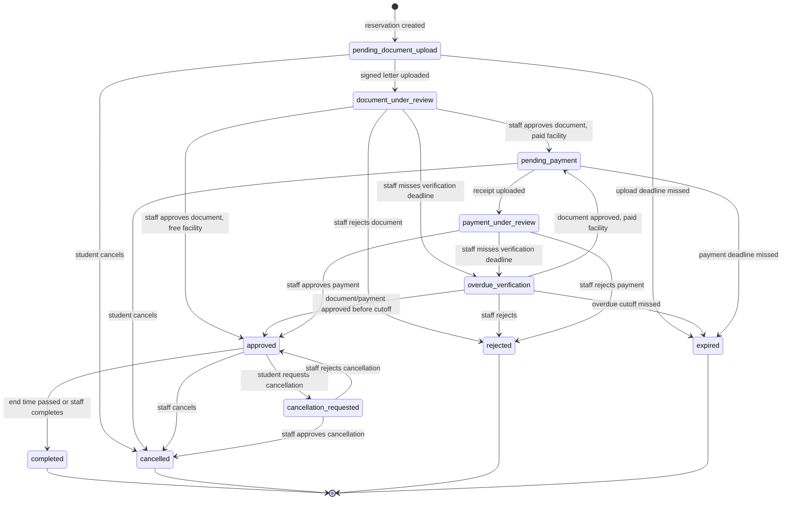
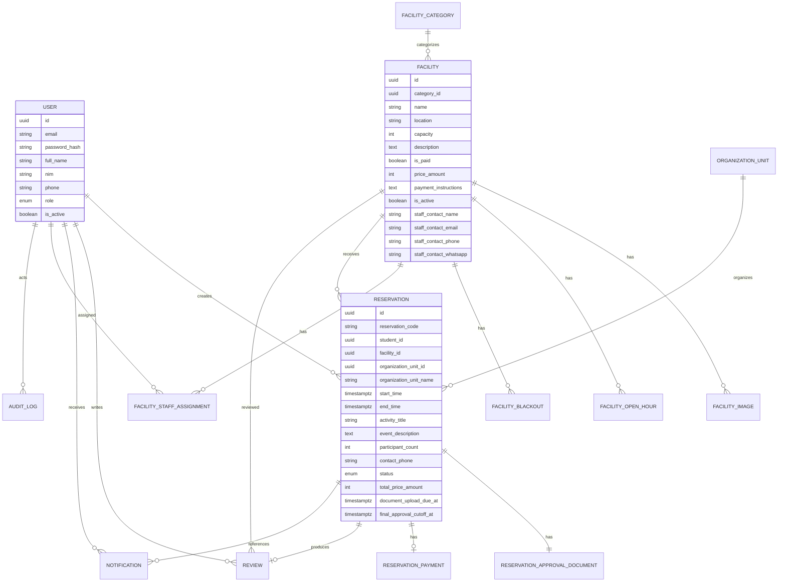
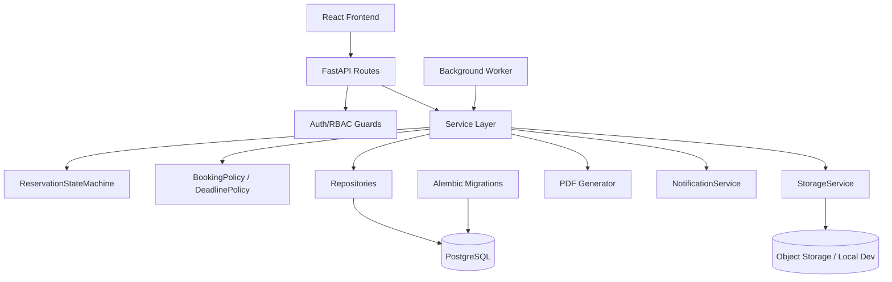

# Refined Plan: IPB Smart Reserve Hub

Dokumen ini merangkum keputusan desain untuk MVP IPB Smart Reserve Hub. Dokumen awal di `docs/initial_prompt.md` tetap dipertahankan sebagai konteks awal.

## 1. Ringkasan Produk

IPB Smart Reserve Hub adalah sistem reservasi fasilitas kampus berbasis web desktop-first. Sistem memfasilitasi mahasiswa untuk melihat katalog fasilitas, mengecek kalender reservasi, membuat pengajuan peminjaman, mengunduh dan mengunggah surat persetujuan, mengunggah bukti pembayaran untuk fasilitas berbayar, serta memberi review setelah penggunaan selesai.

Aktor utama:

- `student`: membuat reservasi, mengunggah surat dan bukti pembayaran, meminta pembatalan, memberi review.
- `staff`: TU/staf fasilitas yang ditugaskan ke fasilitas tertentu. Mengelola fasilitas terkait, memverifikasi dokumen, pembayaran, dan pembatalan.
- `super_admin`: mengelola seluruh data sistem, user, role, assignment staff, kategori, organisasi, settings, audit log, dan moderasi review.

Bahasa UI, notifikasi, pesan validasi, dan surat persetujuan menggunakan Bahasa Indonesia. Kode backend, nama class, enum, kolom database, dan endpoint tetap menggunakan English.

## 2. Batas MVP

MVP fokus pada satu alur reservasi end-to-end:

1. Mahasiswa melihat katalog fasilitas.
2. Mahasiswa memilih fasilitas.
3. Mahasiswa melihat detail, gambar, kontak TU, kalender publik, harga, dan jam operasional.
4. Mahasiswa memilih waktu reservasi.
5. Mahasiswa mengisi detail acara.
6. Sistem membuat reservasi, menahan slot, membuat `reservation_code`, dan menghasilkan surat persetujuan.
7. Mahasiswa mengunduh surat, mendapatkan tanda tangan offline, lalu mengunggah surat bertanda tangan.
8. Staff fasilitas memverifikasi surat.
9. Jika fasilitas gratis, reservasi menjadi `approved`.
10. Jika fasilitas berbayar, instruksi pembayaran baru ditampilkan setelah surat disetujui.
11. Mahasiswa membayar di luar sistem dan mengunggah screenshot/foto bukti pembayaran.
12. Staff memverifikasi pembayaran.
13. Reservasi menjadi `approved`, lalu efektif `completed` setelah waktu selesai.
14. Mahasiswa dapat membuat satu review setelah reservasi selesai.

Catatan implementasi: setiap implementasi fitur/fix wajib menggunakan TDD per vertical slice sesuai `AGENTS.md`. Dokumen ini tidak memuat test plan detail; test plan dibuat saat implementasi diminta.

## 3. Aturan Reservasi

Aturan waktu:

- Timezone bisnis: `Asia/Jakarta`.
- Database menyimpan timestamp dalam UTC.
- UI/API mengonversi waktu ke/dari `Asia/Jakarta`.
- Start dan end time harus berada pada tanggal lokal yang sama.
- Reservasi lintas tengah malam tidak didukung pada MVP.
- Granularitas waktu: kelipatan 5 menit.
- Durasi minimum: 1 jam.
- Minimum booking lead time: 14 hari sebelum `start_time`.
- Maximum booking advance: 60 hari sebelum `start_time`.
- Reservasi harus full approved minimal 7 hari sebelum `start_time`.
- Jika terjadi overdue karena staff terlambat verifikasi, cutoff dapat turun menjadi 4 hari sebelum `start_time`.

Deadline:

- `document_upload_due_at`: 3 hari setelah reservasi dibuat.
- `document_verification_due_at`: 2 hari setelah surat bertanda tangan diunggah.
- `payment_upload_due_at`: 1 hari setelah dokumen disetujui, hanya untuk fasilitas berbayar.
- `payment_verification_due_at`: 1 hari setelah bukti pembayaran diunggah.
- `final_approval_cutoff_at`: 7 hari sebelum reservasi.
- `overdue_final_approval_cutoff_at`: 4 hari sebelum reservasi, hanya jika keterlambatan disebabkan staff.

Tidak ada revision flow pada MVP. Jika surat atau pembayaran ditolak, reservasi menjadi `rejected` dan mahasiswa harus membuat reservasi baru. Rejection reason wajib diisi.

## 4. Status Reservasi

Status utama:

- `pending_document_upload`
- `document_under_review`
- `pending_payment`
- `payment_under_review`
- `approved`
- `completed`
- `overdue_verification`
- `cancelled`
- `rejected`
- `expired`
- `cancellation_requested`

Status yang menahan slot:

- `pending_document_upload`
- `document_under_review`
- `pending_payment`
- `payment_under_review`
- `approved`
- `overdue_verification`
- `cancellation_requested`

Status yang tidak menahan slot:

- `cancelled`
- `rejected`
- `expired`
- `completed`

`completed` dapat dihitung secara efektif dari `approved` dengan `end_time < now()`, lalu dipersist oleh background worker untuk kemudahan query dan tampilan.

## 5. Data Utama

Gunakan UUID sebagai primary key untuk entity utama. Jangan expose sequential integer ID di URL. Reservasi juga memiliki kode operasional seperti `RSV-2026-000123`.

Uang disimpan sebagai integer Rupiah, tanpa floating point. Untuk MVP mata uang fixed `IDR`, ditampilkan sebagai contoh `Rp150.000`.

### Entity

- `User`: akun student/staff/super_admin.
- `Facility`: fasilitas kampus, status aktif, harga flat, instruksi pembayaran, kontak TU.
- `FacilityCategory`: kategori fasilitas.
- `FacilityImage`: satu cover image untuk katalog dan beberapa gambar untuk detail.
- `FacilityStaffAssignment`: mapping staff ke fasilitas.
- `OrganizationUnit`: fakultas, departemen, organisasi mahasiswa, panitia, atau unit lain.
- `FacilityOpenHour`: jam operasional mingguan.
- `FacilityBlackout`: periode blackout/maintenance/libur.
- `Reservation`: data reservasi, status, waktu, detail acara, snapshot harga.
- `ReservationApprovalDocument`: dokumen surat persetujuan.
- `ReservationPayment`: pembayaran manual dan bukti pembayaran.
- `Review`: rating dan komentar mahasiswa.
- `Notification`: notifikasi in-app.
- `SystemSetting`: konfigurasi deadline, booking window, domain email.
- `AuditLog`: jejak aksi penting.

### ERD Ringkas

## 6. Detail Domain

### Facility

Fasilitas memiliki:

- nama, lokasi, kapasitas, deskripsi
- kategori tunggal
- gambar publik
- jam operasional mingguan
- blackout periods
- status aktif/nonaktif
- flat price per reservation jika berbayar
- payment instructions, hanya ditampilkan setelah dokumen disetujui
- kontak TU per fasilitas

Deaktivasi fasilitas hanya mencegah reservasi baru. Reservasi yang sudah ada tetap berjalan dan harus ditangani eksplisit oleh staff.

Gambar fasilitas:

- `FacilityImage` menyimpan banyak gambar detail.
- Tepat satu gambar aktif memiliki `is_cover = true` untuk kartu katalog/homepage.
- Detail fasilitas menampilkan semua gambar aktif berdasarkan `sort_order`, termasuk cover.
- Gambar fasilitas bersifat publik dan dapat memakai public URL/CDN.

### OrganizationUnit

`OrganizationUnit` dipakai untuk field pengorganisasi acara, bukan profil mahasiswa.

Field:

- `name`
- `type`: `faculty`, `department`, `student_organization`, `committee`, `other`
- `code`
- `is_active`

Mahasiswa wajib memilih dari daftar aktif. Tidak ada free text `Other` pada MVP. Super Admin mengelola list ini. Reservasi menyimpan `organization_unit_id` dan snapshot `organization_unit_name`.

### User

Student self-registration menggunakan email/password tanpa email verification. Untuk MVP, email harus cocok dengan allowed institutional domain dari `SystemSetting`, misalnya seed awal `apps.ipb.ac.id`.

Field profil student wajib sebelum reservasi:

- full name
- NIM
- email
- phone/WhatsApp

Tidak ada faculty/department di profil student.

Staff dan Super Admin dibuat oleh admin, tidak self-register. User memiliki `is_active`; inactive user tidak bisa login/refresh token, tetapi histori tetap utuh.

## 7. Kalender Publik dan Privasi

Mahasiswa dapat melihat reservasi lain di kalender fasilitas, tetapi hanya data terbatas:

- rentang waktu
- nama fasilitas
- activity title
- organization unit

Jangan tampilkan:

- nama student
- NIM
- kontak
- event description
- dokumen
- payment status
- receipt
- catatan keputusan internal
- status kategori workflow

Pending reservation yang menahan slot dan approved reservation ditampilkan dengan gaya visual yang sama sebagai slot terisi.

## 8. Approval Letter

Surat persetujuan dibuat sebagai PDF spesifik reservasi dan dapat diunduh berkali-kali.

Surat berisi:

- reservation code
- tanggal generate
- nama student, NIM, email, phone/WhatsApp
- organization unit
- nama dan lokasi fasilitas
- tanggal, start time, end time
- activity title
- event description
- participant count
- pernyataan tanggung jawab / aturan penggunaan
- area tanda tangan student/perwakilan organisasi
- area approval/tanda tangan pihak offline jika diperlukan
- kontak TU
- QR code/link internal ke detail reservasi staff

QR/link wajib butuh login staff assigned atau Super Admin. Tidak ada public verification link.

Upload signed letter hanya bisa dilakukan setelah generated letter tersedia. TU melakukan verifikasi manual terhadap reservation code, detail acara, tanda tangan, dan keterbacaan. Tidak ada automated document comparison pada MVP.

File signed letter:

- Format: PDF, JPG, JPEG, PNG.
- Max size: 5 MB.
- Upload via FastAPI.
- Private storage.

## 9. Pembayaran

Fasilitas bisa gratis atau berbayar. Untuk MVP:

- harga flat per reservation
- harga disimpan di `Facility.price_amount`
- saat reservasi dibuat, harga disalin ke `Reservation.total_price_amount`
- tidak ada add-ons
- tidak ada duration-based pricing
- tidak ada payment gateway
- pembayaran dilakukan di luar sistem
- student upload screenshot/foto receipt
- refund tidak ditangani sistem

Instruksi pembayaran hanya muncul setelah signed letter disetujui. Sebelum itu, UI hanya menampilkan informasi umum bahwa fasilitas berbayar dan nominal harga.

Receipt upload hanya valid di status `pending_payment`. Untuk fasilitas gratis atau status belum valid, API harus menolak dengan pesan jelas.

File receipt:

- Format: JPG, JPEG, PNG.
- Max size: 5 MB.
- Upload via FastAPI.
- Private storage.
- TU memverifikasi manual.

## 10. Pembatalan

Sebelum `approved`, student dapat membatalkan langsung.

Setelah `approved`, student membuat cancellation request dengan alasan:

- slot tetap tertahan selama request pending
- staff dapat approve atau reject
- cancellation rejection reason wajib
- jika paid reservation, UI wajib menampilkan warning bahwa sistem tidak memproses refund dan student harus menghubungi TU di luar sistem

Cancelled reservation tidak bisa direview.

## 11. Review dan Rating

Review hanya bisa dibuat oleh student pemilik reservasi yang sudah selesai.

Aturan:

- satu review per completed reservation
- rating integer 1-5
- komentar opsional
- tidak bisa diedit setelah submit
- bisa soft delete oleh pemilik review
- sebelum submit, tampilkan peringatan: review tidak dapat diedit setelah dikirim, tetapi dapat dihapus
- facility average rating dan review count mengecualikan review soft-deleted

Staff tidak bisa reply, edit, delete, atau moderate review pada MVP.

Super Admin dapat:

- melihat semua review
- filter by facility, rating, date, active/deleted
- soft delete review dengan alasan
- restore review
- tidak bisa mengedit isi atau rating

Jika Super Admin menghapus review, student pemilik review dapat melihat bahwa review dihapus admin beserta alasannya. Public facility page tidak menampilkan atau menghitung review tersebut.

## 12. Notifikasi In-App

MVP hanya memakai in-app notification. Tidak ada email, WhatsApp automation, atau push notification.

`Notification` menyimpan:

- `user_id`
- `type`
- `title`
- `message`
- optional `reservation_id`
- `created_at`
- `read_at`

Notifikasi dibuat sinkron di service saat transisi penting. TU notification dikirim hanya ke staff yang assigned ke fasilitas terkait, plus Super Admin untuk visibility.

Notifikasi penting:

- reservation created
- signed letter uploaded
- document approved/rejected
- payment required
- receipt uploaded
- payment approved/rejected
- reservation approved/expired/cancelled
- cancellation requested/approved/rejected
- document/payment verification overdue

Jika verification overdue, student melihat kontak TU fasilitas dan staff menerima notifikasi untuk segera memverifikasi.

## 13. Audit Log

Tambahkan lightweight `AuditLog` untuk aksi penting:

- actor user ID
- action type
- target type
- target ID
- timestamp
- metadata JSON ringkas

Contoh action:

- reservation created/cancelled
- document uploaded/approved/rejected
- payment uploaded/approved/rejected
- cancellation requested/approved/rejected
- review deleted/restored
- facility updated
- staff assignment changed

Audit log terlihat hanya untuk Super Admin di `/admin/audit-logs`, dengan filter actor, action type, target type, dan date range.

## 14. Background Worker

Tambahkan worker/scheduler backend untuk transisi berbasis waktu:

- expire reservation jika student melewati document upload deadline
- mark overdue jika staff melewati document/payment verification deadline
- expire reservation jika melewati normal/overdue final approval cutoff
- persist `completed` setelah end time lewat

Jika deployment worker belum siap, logic yang sama bisa dijalankan opportunistically pada request relevan, tetapi desain bersih tetap menyertakan worker.

## 15. Arsitektur Backend

Stack:

- Python
- FastAPI
- SQLAlchemy
- Alembic
- PostgreSQL
- Pydantic

Struktur layer:

- `models`: SQLAlchemy ORM entities
- `schemas`: Pydantic request/response DTOs
- `repositories`: akses database per aggregate/root concept
- `services`: workflow bisnis
- `api/routes`: router tipis, auth, dan call service
- `core`: config, auth, RBAC, time utilities, exceptions
- `storage`: `StorageService` interface dan implementasi local/S3-compatible
- `pdf`: approval letter generator
- `notifications`: helper/factory untuk in-app notifications
- `workers`: deadline dan completion jobs

Repository boleh mengembalikan SQLAlchemy ORM model ke service. API route tidak boleh memakai repository langsung.

Gunakan value object / helper class ringan:

- `ReservationStatus`
- `DocumentStatus`
- `PaymentStatus`
- `TimeSlot`
- `BookingSettings`
- `BookingPolicy`
- `DeadlinePolicy`
- `ReservationStateMachine`

### Class Diagram

```mermaid
classDiagram
    class ReservationService {
        +create_reservation()
        +cancel_before_approval()
        +request_cancellation()
        +complete_if_due()
    }

    class DocumentService {
        +get_approval_letter()
        +download_generated_letter()
        +upload_signed_letter()
        +approve_document()
        +reject_document()
    }

    class PaymentService {
        +get_payment_page()
        +upload_receipt()
        +approve_payment()
        +reject_payment()
    }

    class ReviewService {
        +create_review()
        +soft_delete_review()
        +admin_delete_review()
        +restore_review()
    }

    class FacilityService {
        +list_facilities()
        +get_facility_detail()
        +manage_open_hours()
        +manage_blackouts()
    }

    class NotificationService {
        +notify_user()
        +notify_facility_staff()
        +mark_read()
    }

    class ReservationStateMachine {
        +can_upload_signed_letter()
        +can_approve_document()
        +can_open_payment()
        +can_upload_payment_receipt()
        +can_approve_payment()
        +can_request_cancellation()
        +is_blocking_slot()
    }

    class BookingPolicy {
        +validate_creation_window()
        +validate_time_increment()
        +validate_same_day()
        +validate_min_duration()
    }

    class DeadlinePolicy {
        +document_upload_due()
        +document_verification_due()
        +payment_upload_due()
        +payment_verification_due()
        +final_approval_cutoff()
    }

    class ReservationRepository
    class FacilityRepository
    class UserRepository
    class ReviewRepository
    class NotificationRepository

    class StorageService {
        <<interface>>
        +save_private()
        +save_public()
        +get_signed_url()
        +get_public_url()
    }

    class PdfGenerator {
        +generate_approval_letter()
    }

    ReservationService --> ReservationRepository
    ReservationService --> FacilityRepository
    ReservationService --> ReservationStateMachine
    ReservationService --> BookingPolicy
    ReservationService --> DeadlinePolicy
    ReservationService --> NotificationService

    DocumentService --> ReservationRepository
    DocumentService --> ReservationStateMachine
    DocumentService --> StorageService
    DocumentService --> PdfGenerator
    DocumentService --> NotificationService

    PaymentService --> ReservationRepository
    PaymentService --> ReservationStateMachine
    PaymentService --> StorageService
    PaymentService --> NotificationService

    ReviewService --> ReviewRepository
    ReviewService --> ReservationRepository
    FacilityService --> FacilityRepository
    NotificationService --> NotificationRepository
```

### Backend Architecture

## 16. Storage dan Upload

Gunakan `StorageService` abstraction:

- Local filesystem implementation untuk development.
- S3-compatible implementation untuk production, misalnya Cloudflare R2, Supabase Storage, AWS S3, atau provider lain.

Policy:

- Facility images: public.
- Generated letters, signed letters, receipts: private.
- FastAPI melakukan authorization sebelum memberi short-lived signed URL untuk private downloads.
- Upload file lewat FastAPI untuk MVP.
- Original filename hanya metadata, tidak dipakai sebagai path.
- Storage key random.
- Simpan MIME type, extension, size, checksum, uploader, upload timestamp.
- Validasi extension dan MIME allowlist per purpose.
- Max size default 5 MB untuk signed letters dan receipts.
- Antivirus scanning future work.

## 17. Database dan Constraint

Gunakan Alembic untuk seluruh schema migration.

Conflict prevention harus ditegakkan di database/service layer, bukan hanya UI. Untuk PostgreSQL, gunakan transaction dan idealnya exclusion constraint berbasis time range per facility untuk active blocking statuses.

Availability valid jika:

- berada dalam jam operasional fasilitas
- tidak overlap blackout
- tidak overlap active blocking reservation
- memenuhi granularitas 5 menit
- durasi minimal 1 jam
- berada dalam window 14-60 hari
- tidak melewati final approval feasibility

## 18. API Endpoint Esensial

Gunakan workflow-specific endpoints. Hindari generic state mutation seperti `PATCH /reservations/{id}` untuk transisi bisnis.

Student/public:

- `POST /auth/register`
- `POST /auth/login`
- `POST /auth/refresh`
- `GET /auth/me`
- `GET /facilities`
- `GET /facilities/{id}`
- `GET /facilities/{id}/calendar`
- `GET /facilities/{id}/availability`
- `POST /reservations`
- `GET /reservations`
- `GET /reservations/{id}`
- `POST /reservations/{id}/cancel`
- `POST /reservations/{id}/cancellation-request`
- `GET /reservations/{id}/approval-letter`
- `GET /reservations/{id}/approval-letter/download`
- `POST /reservations/{id}/approval-letter/signed-upload`
- `GET /reservations/{id}/payment`
- `POST /reservations/{id}/payment/receipt-upload`
- `POST /reservations/{id}/review`
- `DELETE /reviews/{id}`
- `GET /notifications`
- `POST /notifications/{id}/read`

Staff:

- `GET /staff/facilities`
- `POST /staff/facilities`
- `PUT /staff/facilities/{id}`
- `POST /staff/facilities/{id}/images`
- `PUT /staff/facilities/{id}/open-hours`
- `GET /staff/facilities/{id}/blackouts`
- `POST /staff/facilities/{id}/blackouts`
- `DELETE /staff/facilities/{id}/blackouts/{blackout_id}`
- `GET /staff/reservations`
- `GET /staff/reservations/{id}`
- `GET /staff/reservations/{id}/document`
- `POST /staff/reservations/{id}/document/approve`
- `POST /staff/reservations/{id}/document/reject`
- `GET /staff/reservations/{id}/payment`
- `POST /staff/reservations/{id}/payment/approve`
- `POST /staff/reservations/{id}/payment/reject`
- `GET /staff/reservations/{id}/cancellation`
- `POST /staff/reservations/{id}/cancellation/approve`
- `POST /staff/reservations/{id}/cancellation/reject`
- `GET /staff/facilities/{id}/reviews`
- `GET /staff/facilities/{id}/statistics`

Admin:

- `GET /admin/users`
- `POST /admin/users`
- `PUT /admin/users/{id}`
- `GET /admin/facilities`
- `GET /admin/facilities/{id}/staff`
- `PUT /admin/facilities/{id}/staff`
- `GET /admin/categories`
- `POST /admin/categories`
- `PUT /admin/categories/{id}`
- `GET /admin/organization-units`
- `POST /admin/organization-units`
- `PUT /admin/organization-units/{id}`
- `GET /admin/reservations`
- `GET /admin/settings`
- `PUT /admin/settings`
- `GET /admin/reviews`
- `POST /admin/reviews/{id}/delete`
- `POST /admin/reviews/{id}/restore`
- `GET /admin/audit-logs`
- `GET /admin/system-status`

## 19. Frontend Pages

Prioritas UX adalah desktop-first web layout, dengan baseline responsiveness agar layout tidak rusak di layar kecil.

Student:

- `/facilities`
- `/facilities/{facility_id}`
- `/facilities/{facility_id}/reserve/time`
- `/facilities/{facility_id}/reserve/details`
- `/reservations`
- `/reservations/{reservation_id}`
- `/reservations/{reservation_id}/letter`
- `/reservations/{reservation_id}/payment`
- `/reservations/{reservation_id}/review`
- `/notifications`

Staff:

- `/staff/facilities`
- `/staff/facilities/new`
- `/staff/facilities/{id}/edit`
- `/staff/facilities/{id}/blackouts`
- `/staff/facilities/{id}/reviews`
- `/staff/facilities/{id}/statistics`
- `/staff/reservations`
- `/staff/reservations/{id}`
- `/staff/reservations/{id}/document`
- `/staff/reservations/{id}/payment`
- `/staff/reservations/{id}/cancellation`
- `/staff/notifications`

Super Admin:

- `/admin/users`
- `/admin/facilities`
- `/admin/facilities/{id}/staff`
- `/admin/categories`
- `/admin/organization-units`
- `/admin/reservations`
- `/admin/settings`
- `/admin/reviews`
- `/admin/audit-logs`
- `/admin/system-status`

Frontend menggunakan React dan Tailwind CSS dengan internal component set: buttons, inputs, selects, dialogs, tables, tabs, badges, upload fields, calendars, status timeline. Rekomendasikan component/library spesifik hanya saat implementasi membutuhkan, misalnya `react-big-calendar` untuk calendar-heavy interactions dan `date-fns`/`dayjs` untuk date-time.

## 20. Statistik

Student melihat public review data di facility detail:

- average rating
- review count
- review list aktif

Assigned staff dan Super Admin melihat operational statistics:

- total reservations this month
- approved/cancelled/rejected/expired counts
- utilization hours
- revenue untuk paid facilities
- average rating
- recent reviews

Untuk MVP, statistik dihitung on demand dari query database. Cached aggregates future work.

## 21. Settings

Gunakan `SystemSetting` dengan typed `BookingSettings` di service layer. Simpan durasi internal sebagai jam.

Default:

- `min_booking_lead_hours = 336`
- `max_booking_advance_hours = 1440`
- `document_upload_due_hours = 72`
- `document_verification_due_hours = 48`
- `payment_upload_due_hours = 24`
- `payment_verification_due_hours = 24`
- `final_approval_cutoff_hours = 168`
- `overdue_final_approval_cutoff_hours = 96`
- `allowed_student_email_domains = ["apps.ipb.ac.id"]`

Super Admin dapat mengubah settings dari `/admin/settings`.

## 22. Deployment

Target hosting:

- Frontend: Vercel.
- Backend/API: Railway.
- Database: PostgreSQL di Railway atau managed PostgreSQL lain.
- Storage: S3-compatible object storage.

Production membutuhkan konfigurasi:

- database URL
- JWT/access-token secrets
- allowed CORS origins
- object storage credentials
- public storage base URL untuk facility images
- private signed URL expiry
- app timezone/business timezone
- allowed email domains
- worker process/schedule configuration

`/admin/system-status` optional, read-only:

- backend health
- database connectivity
- storage connectivity
- app version/build info
- worker status jika tersedia

## 23. Implementation Phases

1. Backend foundation: auth, RBAC, schema, migrations, settings, storage abstraction.
2. Facility catalog, facility detail, images, categories, organization units, open hours, blackout periods.
3. Reservation creation: choose facility/time/details, booking rules, conflict prevention, generated reservation code.
4. Approval letter workflow: generate/download letter, signed letter upload, staff document review.
5. Paid reservation workflow: reveal payment instructions after document approval, receipt upload, staff payment review.
6. Cancellation workflow: immediate pre-approval cancellation, post-approval cancellation request, refund warning.
7. Reviews and ratings: completed-only reviews, no edits, soft delete, admin moderation.
8. Notifications and deadlines: in-app notifications, worker for expiration/overdue/completion.
9. Staff dashboards: facility management, verification queues, facility reviews/statistics.
10. Super Admin: users, staff assignments, categories, organization units, settings, reviews, audit logs, optional system status.
11. Frontend integration and desktop-first UX polish.
12. Deployment readiness: Vercel/Railway env config, object storage, production settings.

Setiap phase diimplementasikan dengan TDD vertical slices ketika development dimulai.

## 24. Out of Scope MVP

Tidak termasuk MVP:

- SSO
- email verification
- payment gateway
- refund handling di dalam sistem
- add-ons
- mobile-first optimization
- email/WhatsApp/push notifications
- OCR atau automated receipt validation
- automated signed-letter comparison
- staff reply terhadap review
- user impersonation
- hard delete untuk domain records
- public QR verification link
- advanced observability dashboard
- duration-based pricing
- revision flow untuk dokumen/pembayaran
- student-created organization units
- multi-role user
- complex recurring availability exceptions
- antivirus scanning upload
